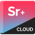

<h4 align="center">
<a href="https://docs.medelfor.com/medelfor/surreal-docs">Documentation</a> |
<a href="https://surrealdocs.com/medelfor/showcase-1">Live-Demo</a> | 
<a href="https://medelfor.com">Medelfor</a> |
<a href="https://store.medelfor.com">Store</a> |
<a href="https://issues.internal.medelfor.com/youtrack/issues?q=project:%20%7BSurreal%20Docs%7D">Known Issues</a> |
<a href="https://www.linkedin.com/company/medelfor/">LinkedIn</a> |
<a href="https://twitter.com/medelfor">Twitter</a>
</h4>

***

Surreal Docs is the first all-encompassing docs generation system for Unreal Engine-powered projects. It generates documentation for Unreal Engine projects, C++ and Blueprint API references in particular. It enables users to create their own custom pages using a feature-rich dialect of Markdown. Surreal Docs seamlessly integrates with our online docs hosting - Surreal Cloud, making it easy to share the docs publicly, privately with a team or within an organization. Finally, Surreal Docs perfectly understands all UE-specific C++ features, Blueprints and easily interweaves corresponding C++ and Blueprint entities in the resulting documentation!

**Table of Contents**

- [Install](#install)
- [Quickstart](#quickstart)
- [OS and Unreal Engine Compatibilty](#os-and-unreal-engine-compatibilty)
- [Telemetry](#telemetry)
- [Privacy](#privacy)
- [Build](#build)
- [Issues and Support](#issues-and-support)
- [Pull requests](#pull-requests)
- [FAQ](#faq)
- [License](#license)
- [Surreal Ecosystem](#surreal-ecosystem)

## Install

To install Surreal Docs please download the latest installer from the Releases
page and run it. Note, that in order to work correctly Surreal Docs 
requires NodeJS (at least 10.18.1) to be installed with `npm` being available in PATH.
If no NodeJS is already installed on your system, Surreal Docs installer will
install an appropriate version (18.16.0) automatically.

Note also that in order to work Surreal Docs requires Microsoft Visual Studio to
be installed on your machine.

You can find more info about the installation process on the ["Installation"](https://docs.medelfor.com/medelfor/surreal-docs/latest/en-US/docs/installation "Installation process description") page of [Surreal Docs documentation](https://docs.medelfor.com/medelfor/surreal-docs "Surreal Docs documentation").

## Quickstart

Surreal Docs installer installs the Surreal Docs CLI, so you would be able
to run Surreal Docs from the command line.

In order to generate documentation for your Unreal Engine project, please open
a console of your choice (Windows CMD, PowerShell, etc.) and navigate to the 
root directory[1] of your Unreal Engine project.

When done, please run the following command in your console:
```
surdocs init
```

It will invoke the initialization screen where you can set options of your project
and the documentation you are going to generate. Surreal Docs will detect and set most
settings automatically, but you should review them and update if 
necessary.

On the same screen you should choose the project modules for which you want to generate documentation.

After everything's finished, please click the "Done" button and wait until
Surreal Docs will set up your project.

Note that Surreal Docs changes the `.uproject` file, so before changing it,
the system makes a backup of the file and saves it in the same directory.

The `surdocs init` must be run only once, on the initial setup of the project.

If `surdocs init` has finished successfully, then please run the next command:

```
surdocs generate <output directory>
```

It will invoke the generation screen and start generating your documentation.
You will be able to observe the progress and will see error's details if
something goes wrong.

Note that the first time you run `surdocs generate` the generation will take some
extra time, since Surreal Docs needs to compile the plugin it installs in order
to link with Unreal Engine.

You can find more info that will help you get up to speed on the ["Quickstart"](https://docs.medelfor.com/medelfor/surreal-docs/latest/en-US/docs/quickstart "Quickstart") page.

***
[1] The directory that contains the `.uproject` file.

## OS and Unreal Engine Compatibilty

Surreal Docs is intended to be used with 64-bit Windows systems.

Unreal Engine support is as follows:

| Unreal Engine version | Support [1]    |
|-----------------------|----------------|
| 4.27                  | Yes            |
| 5.0                   | Yes            |
| 5.1                   | Yes            |
| 5.2                   | On the way [2] |

You can find more info about OS and Unreal Engine compatibility on the ["Supported operating systems and Unreal Engine versions"](https://docs.medelfor.com/medelfor/surreal-docs/latest/en-US/docs/os-and-ue-support "Supported operating systems and Unreal Engine versions") page.

***
[1] At the moment we do not support documenting the following UE-features:
Animation Blueprints 
([SD-1048](https://issues.internal.medelfor.com/youtrack/issue/SD-1048/Add-support-for-animation-BPs "Animation BPs")),
Latent Functions 
([SD-1084](https://issues.internal.medelfor.com/youtrack/issue/SD-1084/Add-support-of-latent-functions "Latent Functions")),
Slate C++ macros 
([SD-1037](https://issues.internal.medelfor.com/youtrack/issue/SD-1037/Add-support-for-Slate-macros "Slate macros"))
and Blueprint Graph Macros
([SD-1047](https://issues.internal.medelfor.com/youtrack/issue/SD-1047/Add-support-for-graph-macros-macros-library "Blueprint Macros")).
If you'd like Surreal Docs to support one of these features, please let us know.

You can find more info about supported Unreal Engine features on the ["Support of the Unreal Engine features"](https://docs.medelfor.com/medelfor/surreal-docs/latest/en-US/docs/ue-features-support "Support of the Unreal Engine features") page.

[2] ETA is June 2023.

## Telemetry

By default, Surreal Docs collects and sends us anonymized usage data, such as
ID of your machine, version of Surreal Docs you're running, etc. In order to
disable it, please provide `--no-tele` argument when starting Surreal Docs CLI.
It will disable the telemetry for the time current command is running. Example:

```
surdocs --no-tele generate out
```

Note however that by letting Surreal Docs collect anonymized usage data
you help the development process a lot. 

The collection of this data is governed by Surreal Docs EULA that can be found
in the `LICENSE` file.

You can find more info about global options available in Surreal Docs CLI on the ["Global options"](https://docs.medelfor.com/medelfor/surreal-docs/latest/en-US/docs/cli/global-options "Global options") page.

## Privacy

Your privacy is important to us! While you can read more about your privacy when
using Surreal Docs in the EULA, you can be sure that we **do not**, under any 
circumstances, collect or send to ourselves (or any 3rd parties) neither
the source code of your project nor the generated documentation.

## Build

We're working on the build instructions and will publish them soon.

## Issues and Support

You can find more info regarding troubleshooting on the ["Troubleshooting"](https://docs.medelfor.com/medelfor/surreal-docs/latest/en-US/docs/troubleshooting "Troubleshooting") page.

If you believe there's something wrong with the product, please create an
issue in this repository.

"Surreal Docs Crypto", "Surreal Docs XL" or "Surreal Docs Crypto
XL" licenses include Priority Customer Care plan. If you or your
organization own one of these licenses please contact us at
[support@medelfor.com](mailto:support@medelfor.com "Support email") with your
license ID and problem description, we will consider the issue a high-priority.

You can browse list of issues already being in work in our YouTrack 
[here](https://issues.internal.medelfor.com/youtrack/issues?q=project:%20%7BSurreal%20Docs%7D "Surreal Docs WIP issues").

## Pull requests

Please, feel free to submit your changes to the Surreal Docs Source
Code in pull requests for this repository. We deeply appreciate any 
contributions made by our users!

## FAQ

### Is there a Linux version of Surreal Docs?
No there's no Linux version of Surreal Docs, and there's no plans to implement one
in the foreseen future. You can find more info about OS compatibility on the ["Supported operating systems and Unreal Engine versions"](https://docs.medelfor.com/medelfor/surreal-docs/latest/en-US/docs/os-and-ue-support "Supported operating systems and Unreal Engine versions") page.

### Is Surreal Docs usage free of charge?

If you're an individual that doesn't intend to use Surreal Docs with crypto-related
projects, then yes, for you Surreal Docs is free of charge.

If you represent a legal entity that doesn't intend to use Surreal Docs with crypto-related
projects and whose revenue for the last year is less than US $100,000, then yes,
for your legal entity Surreal Docs is free of charge.

Consult the [License](#license) section or full EULA text in the `LICENSE` file
for more details.

### Is there support for the Verse programming language?

There's no support for the Verse programming language at the moment, but it will
be added as soon as the main-branch Unreal Engine gets Verse support. You can find more info about supported Unreal Engine features on the ["Support of the Unreal Engine features"](https://docs.medelfor.com/medelfor/surreal-docs/latest/en-US/docs/ue-features-support "Support of the Unreal Engine features") page.

### Can Surreal Docs be used to generate documentation for a plugin?

You bet! Consult [this documentation page](https://docs.medelfor.com/medelfor/surreal-docs/latest/en-US/docs/generate-docs-for-plugins "Generation of documentation for a plugin") to find out how to do it.

### Can Surreal Docs be used with Blueprint-only projects?

Absolutely, but note that Surreal Docs requires installed Microsoft Visual 
Studio no matter whether the project is Blueprint-only or not. You can find more details about it on the ["Generating documentation for Blueprint-only projects"](https://docs.medelfor.com/medelfor/surreal-docs/latest/en-US/docs/generate-docs-for-blueprint-only-projects "Generating documentation for Blueprint-only projects") page.

### Can Surreal Docs be used without an UE-project?

Currently, Surreal Docs cannot be used without an Unreal Engine project, but we
plan to add an ability to generate documentation with no attachments to UE, BP 
or C++ in the nearest future.

## License

Surreal Docs is published under a proprietary license full text of which can be
found in the `LICENSE` file. 

If you are an individual who intends to use Surreal Docs with Unreal Engine 
projects that are not related to cryptocurrencies, NFTs or blockchain then you
can use Surreal Docs free of charge.

If you represent a legal entity whose revenue for the last year (with today as
the last day of the year) is less than US $100,000 and who intends to use
Surreal Docs with Unreal Engine projects that are not related to
cryptocurrencies, NFTs or blockchain then your legal entity can use Surreal Docs
free of charge.

In case of intention to use Surreal Docs with projects related to the
cryptocurrencies (whether you are an individual or represent a legal entity),
you must buy a Surreal Docs license that does not prohibit such usage, e.g. 
"Surreal Docs Crypto" license or "Surreal Docs Crypto XL".

In case of intention to use Surreal Docs by a legal entity with the last year
revenue bigger than US $100,000, the entity must buy a Surreal Docs license that 
does not prohibit such usage, e.g. "Surreal Docs XL" license or
"Surreal Docs Crypto XL".

The licenses can be acquired in [our store](https://store.medelfor.com "Medelfor Store").

Note that this is not a legal advice, please consult with your lawyer on details
of the license agreement or contact [sales@medelfor.com](mailto:sales@medelfor.com "Sales Team")
if you have any questions about licensing of Surreal Docs.

## Surreal Ecosystem

If you need to share your docs on the internet, or privately with the team 
check out our Surreal Cloud product series which makes it easy for developers
to share their documentation with others. We've got a solution for any team,
any use case and in every price range!


[Surreal Cloud](https://medelfor.com/#surreal-cloud "Surreal Cloud") - a
serverless and auto-scaling cloud hosting for public documentation. Surreal
Cloud is the easiest way to make your documentation available to everyone on
the internet. Starts at $17/month (excl. VAT/GST).



[Surreal Cloud+](https://medelfor.com/#surreal-cloud-plus "Surreal Cloud+") -
a Medelfor's cloud for public and private documentation. Surreal
Cloud+ is the best way to share your documentation privately with your team.
Starts at $25/month (excl. VAT/GST).


[Surreal Cloud Pro](https://medelfor.com/#surreal-cloud-pro "Surreal Cloud Pro") -
the pinnacle of Surreal Cloud technology. Includes an on-premises variant
of Surreal Cloud and the online cloud for private and public documentation.
Surreal Cloud Pro is the perfect choice for companies who want to share their
documentation within the organization. Starts at $70/month (excl. VAT/GST).

Any Surreal Cloud solution integrates 100% seamlessly with Surreal Docs.


***

<h5 align="center">Thank you for using Medelfor products!</h5>
